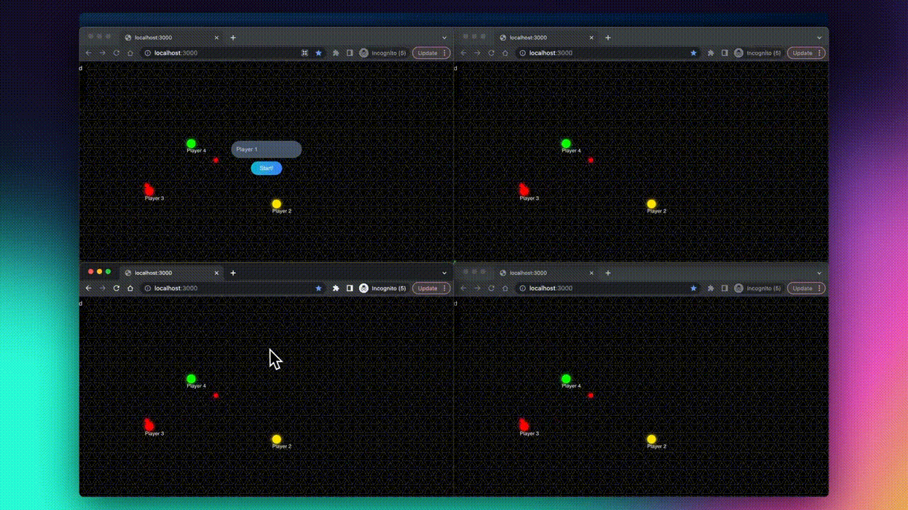

<h1 align="center">Multiplayer Game</h1>

  <p align="center">
    Multiplayer game using js and socket.io
    <br />
    <br />
    <a href="https://azimovs.github.io/cube-surfer/">View Demo</a>
    ·
    <a href="https://github.com/AzimovS/multiplayer-game/issues">Report Bug</a>
    ·
    <a href="https://github.com/AzimovS/multiplayer-game/issues">Request Feature</a>
  </p>
<!-- ABOUT THE PROJECT -->

<p align="center">
  
</p>

The game was developed with the [Chris Courses Online Multiplayer Game Tutorial](https://www.youtube.com/watch?v=Wcvqnx14cZA). The list of features:
* Connect and disconnect users
* Create colors on the backend
* Clientside prediction
* Server Reconciliation
* Projectiles
* Garbage Detection
* Collision Detection
* Dynamic Score updates
* Usernames
* Restrict players to boundaries

### Built With
* JavaScript
* [Socket.io](https://socket.io/)

### Installation

1. Clone the repo
   ```sh
   git clone https://github.com/AzimovS/multiplayer-game/
   ```
2. Install dependencies for a client and start it
   ```sh
   cd multiplayer-game && npm install && node backend.js
   ```
